# Лабораторная работа №4  
**Тема:** Проектирование REST API  
**Цель работы:** Получить опыт проектирования программного интерфейса.

---

## Контекст выбранного сервиса

Единая система адаптации менеджеров по продажам (курсы, диалоговые тренажёры, тесты) + аналитический модуль прогресса и типовых ошибок.  

**Выбранный сервис для ЛР4:** `Analytics API` — сервис, который хранит результаты обучения и отдаёт метрики/прогресс для руководителя и HR.

**Базовый URL (локально):** `http://localhost:8080`  
**Префикс API:** `/api/v1`  
**Формат данных:** `application/json; charset=utf-8`

---

## Принятые проектные решения (не менее 8)

1) **Версионирование API в URL:** `/api/v1/...`  
   *Причина:* безопасная эволюция контрактов и обратная совместимость.

2) **Единый формат ошибок (Problem Details-стиль):**  
   ```json
   {
     "type": "validation_error",
     "title": "Validation failed",
     "status": 400,
     "detail": "Field 'email' is invalid",
     "instance": "/api/v1/trainees",
     "errors": [{"field":"email","message":"must be a valid email"}],
     "traceId": "b2f6c8d2..."
   }
   ```
   *Причина:* одинаковая обработка ошибок на клиенте и в логах.

3) **Идентификаторы ресурсов:** UUID (строка) в path-параметрах: `/trainees/{traineeId}`  
   *Причина:* глобальная уникальность, удобство интеграций.

4) **REST-правила именования:**  
   - существительные во множественном числе: `/trainees`, `/assessments`  
   - фильтрация через query-параметры: `/assessments?traineeId=...&from=...&to=...`

5) **HTTP-коды и идемпотентность:**  
   - `POST` создаёт ресурс → `201 Created` + тело созданного объекта  
   - `GET` читает → `200 OK`  
   - `PUT` обновляет целиком/по договорённости → `200 OK` (или `204 No Content`, но здесь используем `200` с обновлённым объектом)  
   - `DELETE` удаляет → `204 No Content`  
   - `404 Not Found` если ресурс не найден  
   - `409 Conflict` если конфликт уникальности (например, email уже занят)

6) **Пагинация списков:** `page`, `pageSize` + метаданные в ответе  
   *Причина:* стабильная производительность и удобство UI.  
   Пример:
   ```json
   { "items":[...], "page":1, "pageSize":20, "total":153 }
   ```

7) **Аутентификация (упрощённо для лабы):** Bearer Token  
   Заголовок: `Authorization: Bearer <token>`  
   *Примечание:* в реализации для лабы можно временно отключить проверку или использовать фиксированный токен.

8) **Корреляция запросов для трассировки:**  
   Клиент может отправлять `X-Request-Id`, сервис возвращает его обратно и пишет в логи.  
   *Причина:* проще дебажить цепочки запросов.

9) **Валидация входных данных на границе:** обязательность полей, диапазоны, форматы дат ISO-8601.  
   *Причина:* предсказуемость данных и понятные ошибки.

10) **Конвенции дат/времени:** только ISO-8601 в UTC (`2026-02-24T12:30:00Z`).  
    *Причина:* отсутствие ошибок таймзон в аналитике.

---

## Документация по API

Ниже описаны эндпоинты сервиса `Analytics API`.  

### Сущности и модели данных

#### Trainee (стажёр/новичок)
```json
{
  "id": "4c8db0b0-6a58-4f06-92be-6d1c2c4a5e90",
  "fullName": "Иванов Иван",
  "email": "ivanov@example.com",
  "department": "Sales North",
  "hireDate": "2026-02-01",
  "status": "ACTIVE",
  "createdAt": "2026-02-10T09:00:00Z",
  "updatedAt": "2026-02-10T09:00:00Z"
}
```

#### Assessment (результат обучения)
```json
{
  "id": "d1f2a021-9a2f-4b0a-ae6d-8e09f9a6e12b",
  "traineeId": "4c8db0b0-6a58-4f06-92be-6d1c2c4a5e90",
  "type": "TEST", 
  "moduleId": "product_basics_01",
  "score": 78,
  "maxScore": 100,
  "passed": true,
  "completedAt": "2026-02-15T13:10:00Z",
  "errors": [
    {"code": "OBJECTION_HANDLING", "count": 2},
    {"code": "FUNNEL_STAGE_SKIP", "count": 1}
  ]
}
```

#### ProgressMetrics (метрики прогресса)
```json
{
  "traineeId": "4c8db0b0-6a58-4f06-92be-6d1c2c4a5e90",
  "period": {"from":"2026-02-01","to":"2026-02-29"},
  "avgScore": 81.2,
  "passRate": 0.86,
  "completedModules": 7,
  "riskLevel": "MEDIUM",
  "topErrorCodes": ["OBJECTION_HANDLING","CLOSING_DEAL"]
}
```

---

## Endpoints

> Во всех примерах ниже предполагается заголовок:  
> `Content-Type: application/json`  

### 1) Создать стажёра  
**Метод:** `POST`  
**URL:** `/api/v1/trainees`

**Body (request):**
```json
{
  "fullName": "Иванов Иван",
  "email": "ivanov@example.com",
  "department": "Sales North",
  "hireDate": "2026-02-01"
}
```

**Успешный ответ:** `201 Created`  
```json
{
  "id": "4c8db0b0-6a58-4f06-92be-6d1c2c4a5e90",
  "fullName": "Иванов Иван",
  "email": "ivanov@example.com",
  "department": "Sales North",
  "hireDate": "2026-02-01",
  "status": "ACTIVE",
  "createdAt": "2026-02-10T09:00:00Z",
  "updatedAt": "2026-02-10T09:00:00Z"
}
```

**Ошибки:**
- `400` — невалидные поля (email/дата/пустые строки)
- `409` — email уже существует

---

### 2) Получить список стажёров (с пагинацией/фильтрацией)  
**Метод:** `GET`  
**URL:** `/api/v1/trainees`

**Query params:**
- `department` (optional) — фильтр по отделу
- `status` (optional) — `ACTIVE|INACTIVE`
- `page` (optional, default=1)
- `pageSize` (optional, default=20)

**Успешный ответ:** `200 OK`
```json
{
  "items": [
    {
      "id": "4c8db0b0-6a58-4f06-92be-6d1c2c4a5e90",
      "fullName": "Иванов Иван",
      "email": "ivanov@example.com",
      "department": "Sales North",
      "hireDate": "2026-02-01",
      "status": "ACTIVE",
      "createdAt": "2026-02-10T09:00:00Z",
      "updatedAt": "2026-02-10T09:00:00Z"
    }
  ],
  "page": 1,
  "pageSize": 20,
  "total": 1
}
```

---

### 3) Получить стажёра по id  
**Метод:** `GET`  
**URL:** `/api/v1/trainees/{traineeId}`

**Path params:**
- `traineeId` — UUID

**Успешный ответ:** `200 OK` (пример как в п.1)

**Ошибки:**
- `404` — если стажёр не найден

---

### 4) Обновить стажёра  
**Метод:** `PUT`  
**URL:** `/api/v1/trainees/{traineeId}`

**Body (request):**
```json
{
  "fullName": "Иванов Иван Иванович",
  "email": "ivanov@example.com",
  "department": "Sales North",
  "hireDate": "2026-02-01",
  "status": "ACTIVE"
}
```

**Успешный ответ:** `200 OK` — обновлённый объект.

**Ошибки:**
- `400` — невалидные поля
- `404` — стажёр не найден
- `409` — email конфликтует с другим стажёром

---

### 5) Удалить стажёра  
**Метод:** `DELETE`  
**URL:** `/api/v1/trainees/{traineeId}`

**Успешный ответ:** `204 No Content`

**Ошибки:**
- `404` — стажёр не найден

---

### 6) Создать результат обучения (assessment)  
**Метод:** `POST`  
**URL:** `/api/v1/assessments`

**Body (request):**
```json
{
  "traineeId": "4c8db0b0-6a58-4f06-92be-6d1c2c4a5e90",
  "type": "TEST",
  "moduleId": "product_basics_01",
  "score": 78,
  "maxScore": 100,
  "completedAt": "2026-02-15T13:10:00Z",
  "errors": [
    {"code": "OBJECTION_HANDLING", "count": 2},
    {"code": "FUNNEL_STAGE_SKIP", "count": 1}
  ]
}
```

**Успешный ответ:** `201 Created` — объект `Assessment` с `id` и вычисленным `passed`.

**Ошибки:**
- `400` — неверные значения (score > maxScore и т.п.)
- `404` — traineeId не существует

---

### 7) Получить результаты обучения (с фильтрами)  
**Метод:** `GET`  
**URL:** `/api/v1/assessments`

**Query params:**
- `traineeId` (optional)
- `type` (optional) — `TEST|DIALOGUE|FINAL`
- `from` (optional, date-time ISO-8601)
- `to` (optional, date-time ISO-8601)
- `page`, `pageSize`

**Успешный ответ:** `200 OK`
```json
{
  "items": [
    {
      "id": "d1f2a021-9a2f-4b0a-ae6d-8e09f9a6e12b",
      "traineeId": "4c8db0b0-6a58-4f06-92be-6d1c2c4a5e90",
      "type": "TEST",
      "moduleId": "product_basics_01",
      "score": 78,
      "maxScore": 100,
      "passed": true,
      "completedAt": "2026-02-15T13:10:00Z",
      "errors": [
        {"code": "OBJECTION_HANDLING", "count": 2},
        {"code": "FUNNEL_STAGE_SKIP", "count": 1}
      ]
    }
  ],
  "page": 1,
  "pageSize": 20,
  "total": 1
}
```

---

### 8) Получить метрики прогресса по стажёру  
**Метод:** `GET`  
**URL:** `/api/v1/metrics/trainees/{traineeId}`

**Query params:**
- `from` (optional, date `YYYY-MM-DD`)
- `to` (optional, date `YYYY-MM-DD`)

**Успешный ответ:** `200 OK` (см. модель `ProgressMetrics`)

**Ошибки:**
- `404` — traineeId не существует

---

# Тестирование API (Postman)

Ниже — структура тестов и что нужно приложить в отчёт.  

## Тесты по Endpoint'ам

> Минимум **2 теста на каждый endpoint**:  
> - позитивный (ожидаем успех)  
> - негативный (валидация/404/конфликт)

---

## 1) POST /api/v1/trainees — Create Trainee

### Тест 1.1 (позитивный): создать стажёра
- **Метод:** POST  
- **Строка запроса:** `{{baseUrl}}/api/v1/trainees`

**Body (raw JSON):**
```json
{
  "fullName": "Иванов Иван",
  "email": "ivanov@example.com",
  "department": "Sales North",
  "hireDate": "2026-02-01"
}
```

**Ожидаем:**
- Status: `201`
- В ответе есть `id`, `email`

**Tests (Postman):**
```javascript
pm.test("Status is 201", function () {
  pm.response.to.have.status(201);
});

pm.test("Response has trainee id", function () {
  const json = pm.response.json();
  pm.expect(json).to.have.property("id");
  pm.environment.set("traineeId", json.id);
});
```

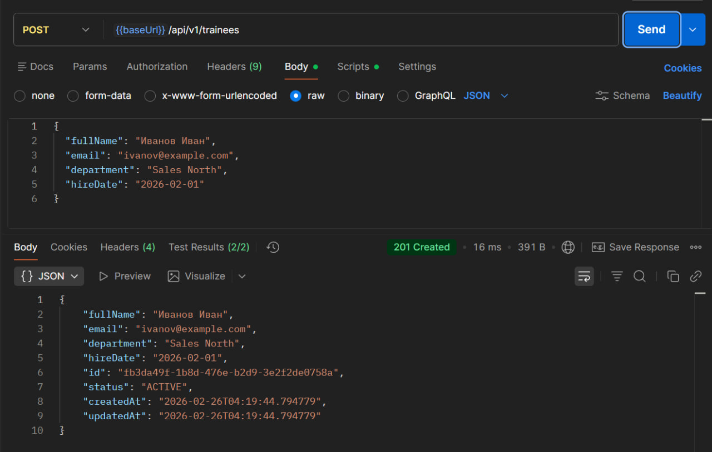

---

### Тест 1.2 (негативный): невалидный email
- **Метод:** POST  
- **URL:** `{{baseUrl}}/api/v1/trainees`

**Body:**
```json
{
  "fullName": "Иванов Иван",
  "email": "not-an-email",
  "department": "Sales North",
  "hireDate": "2026-02-01"
}
```

**Ожидаем:**
- Status: `422`


**Tests:**
```javascript
pm.test("Status is 422", function () {
    pm.response.to.have.status(422);
});
```

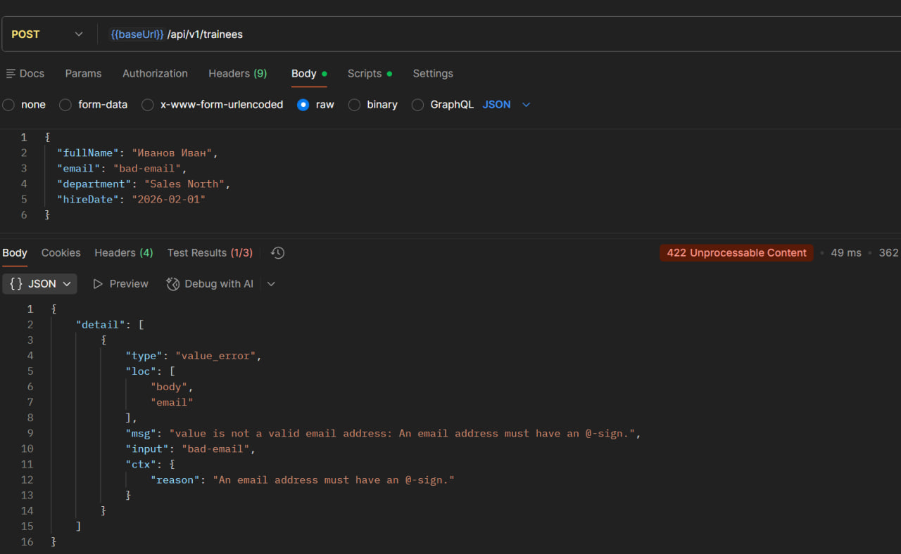

---

## 2) GET /api/v1/trainees — List Trainees

### Тест 2.1 (позитивный): список возвращается
- **Метод:** GET  
- **URL:** `{{baseUrl}}/api/v1/trainees?page=1&pageSize=20`

**Ожидаем:** `200`, есть `items` (array)

**Tests:**
```javascript
pm.test("Status is 200", function () {
    pm.response.to.have.status(200);
});

pm.test("Response is array", function () {
    pm.expect(pm.response.json()).to.be.an("array");
});
```
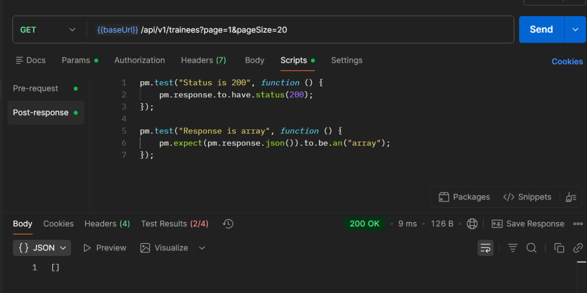

### Тест 2.2 (негативный): некорректная пагинация (pageSize=0)
- **Метод:** GET  
- **URL:** `{{baseUrl}}/api/v1/trainees?page=1&pageSize=0`

**Ожидаем:** `422`

**Tests:**
```javascript
pm.test("Status is 400", () => pm.response.to.have.status(400));
pm.test("Validation error returned", () => {
  const json = pm.response.json();
  pm.expect(json.type).to.eql("validation_error");
});
```

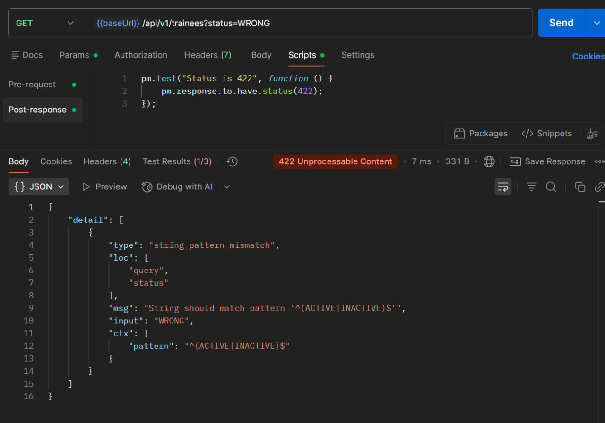

---

## 3) GET /api/v1/trainees/{traineeId} — Get Trainee By Id

### Тест 3.1 (позитивный): получить созданного стажёра
- **Метод:** GET  
- **URL:** `{{baseUrl}}/api/v1/trainees/{{traineeId}}`

**Ожидаем:** `200`, id совпадает

**Tests:**
```javascript
pm.test("Status is 200", () => pm.response.to.have.status(200));
pm.test("Returned traineeId matches env", () => {
  const json = pm.response.json();
  pm.expect(json.id).to.eql(pm.environment.get("traineeId"));
});
```
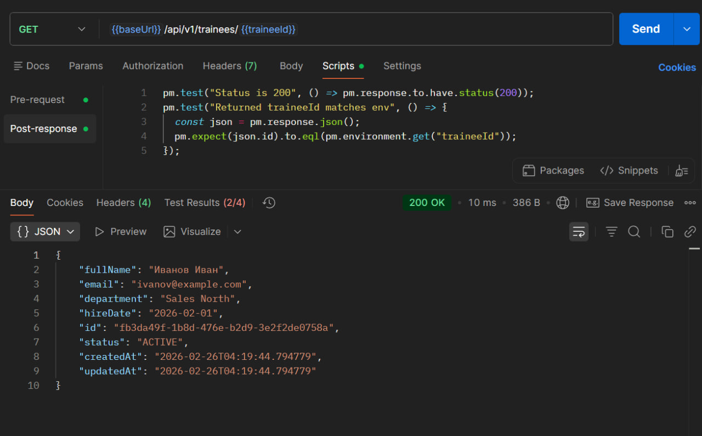
### Тест 3.2 (негативный): несуществующий id
- **Метод:** GET  
- **URL:** `{{baseUrl}}/api/v1/trainees/00000000-0000-0000-0000-000000000000`

**Ожидаем:** `404`

**Tests:**
```javascript
pm.test("Status is 404", () => pm.response.to.have.status(404));
```

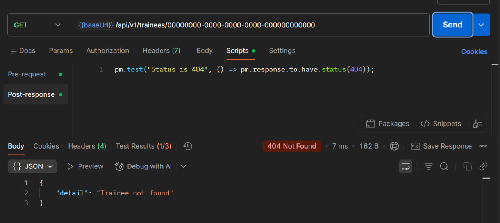

---

## 4) PUT /api/v1/trainees/{traineeId} — Update Trainee

### Тест 4.1 (позитивный): обновить имя
- **Метод:** PUT  
- **URL:** `{{baseUrl}}/api/v1/trainees/{{traineeId}}`

**Body:**
```json
{
  "fullName": "Иванов Иван Иванович",
  "email": "ivanov@example.com",
  "department": "Sales North",
  "hireDate": "2026-02-01",
  "status": "ACTIVE"
}
```

**Ожидаем:** `200`, fullName обновился

**Tests:**
```javascript
pm.test("Status is 200", () => pm.response.to.have.status(200));
pm.test("fullName updated", () => {
  const json = pm.response.json();
  pm.expect(json.fullName).to.eql("Иванов Иван Иванович");
});
```


### Тест 4.2 (негативный): обновление несуществующего id
- **Метод:** PUT  
- **URL:** `{{baseUrl}}/api/v1/trainees/00000000-0000-0000-0000-000000000000`

**Ожидаем:** `404`

**Tests:**
```javascript
pm.test("Status is 404", () => pm.response.to.have.status(404));
```
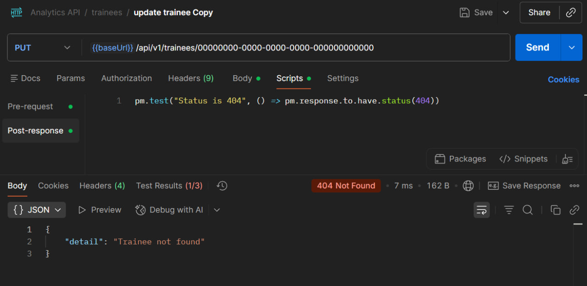

---

## 5) DELETE /api/v1/trainees/{traineeId} — Delete Trainee

### Тест 5.1 (позитивный): удалить стажёра
- **Метод:** DELETE  
- **URL:** `{{baseUrl}}/api/v1/trainees/{{traineeId}}`

**Ожидаем:** `204`

**Tests:**
```javascript
pm.test("Status is 204", () => pm.response.to.have.status(204));
```
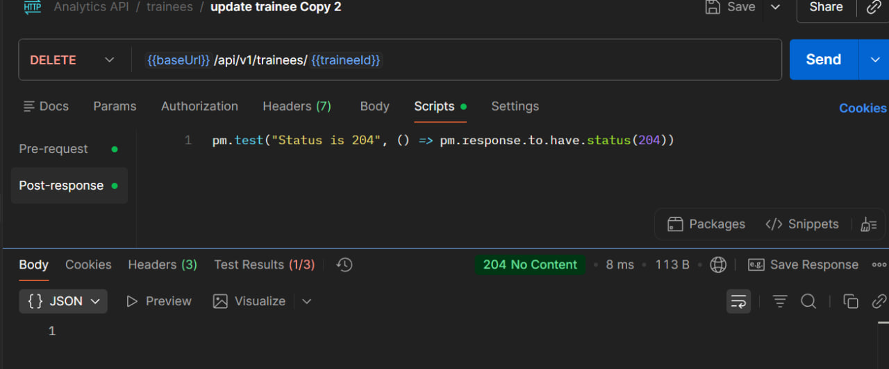

### Тест 5.2 (негативный): удалить несуществующего
- **Метод:** DELETE  
- **URL:** `{{baseUrl}}/api/v1/trainees/00000000-0000-0000-0000-000000000000`

**Ожидаем:** `404`

**Tests:**
```javascript
pm.test("Status is 404", () => pm.response.to.have.status(404));
```
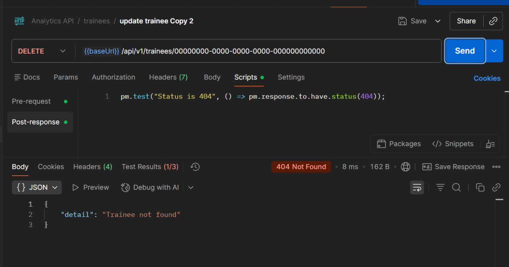

---

## 6) POST /api/v1/assessments — Create Assessment

### Тест 6.1 (позитивный): создать assessment
- **Метод:** POST  
- **URL:** `{{baseUrl}}/api/v1/assessments`

**Body:**
```json
{
  "traineeId": "{{traineeId}}",
  "type": "TEST",
  "moduleId": "product_basics_01",
  "score": 78,
  "maxScore": 100,
  "completedAt": "2026-02-15T13:10:00Z",
  "errors": [
    {"code": "OBJECTION_HANDLING", "count": 2}
  ]
}
```

**Ожидаем:** `201`, есть `id`

**Tests:**
```javascript
pm.test("Status is 201", () => pm.response.to.have.status(201));
pm.test("Response has assessment id", () => {
  const json = pm.response.json();
  pm.expect(json).to.have.property("id");
  pm.environment.set("assessmentId", json.id);
});
```
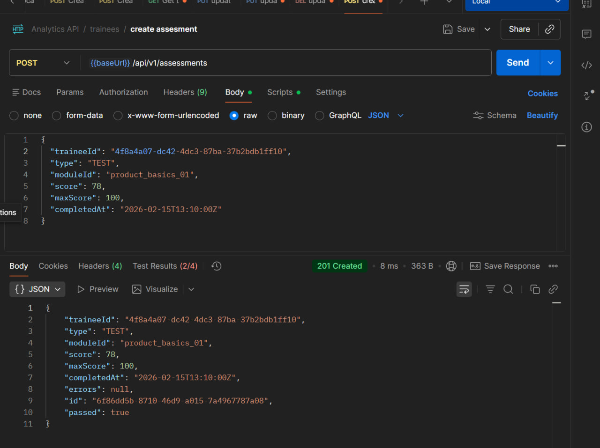
### Тест 6.2 (негативный): score > maxScore
- **Метод:** POST  
- **URL:** `{{baseUrl}}/api/v1/assessments`

**Body:**
```json
{
  "traineeId": "{{traineeId}}",
  "type": "TEST",
  "moduleId": "product_basics_01",
  "score": 120,
  "maxScore": 100,
  "completedAt": "2026-02-15T13:10:00Z"
}
```

**Ожидаем:** `400`

**Tests:**
```javascript
pm.test("Status is 400", () => pm.response.to.have.status(400));
pm.test("Validation error returned", () => {
  const json = pm.response.json();
  pm.expect(json.type).to.eql("validation_error");
});
```
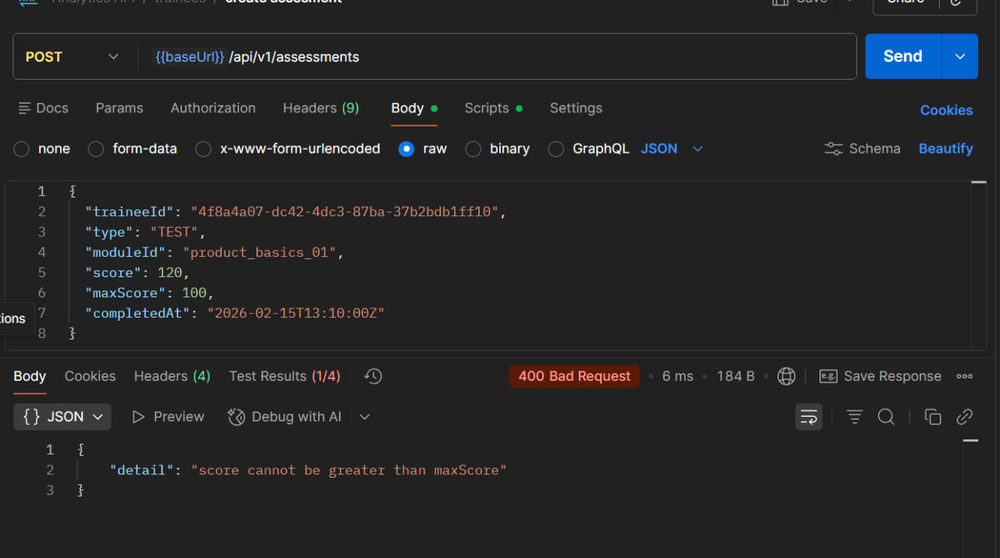

---

## 7) GET /api/v1/assessments — List Assessments

### Тест 7.1 (позитивный): получить по traineeId
- **Метод:** GET  
- **URL:** `{{baseUrl}}/api/v1/assessments?traineeId={{traineeId}}&page=1&pageSize=20`

**Ожидаем:** `200`, items array

**Tests:**
```javascript
pm.test("Status is 200", () => pm.response.to.have.status(200));
pm.test("items is array", () => {
  const json = pm.response.json();
  pm.expect(json.items).to.be.an("array");
});
```
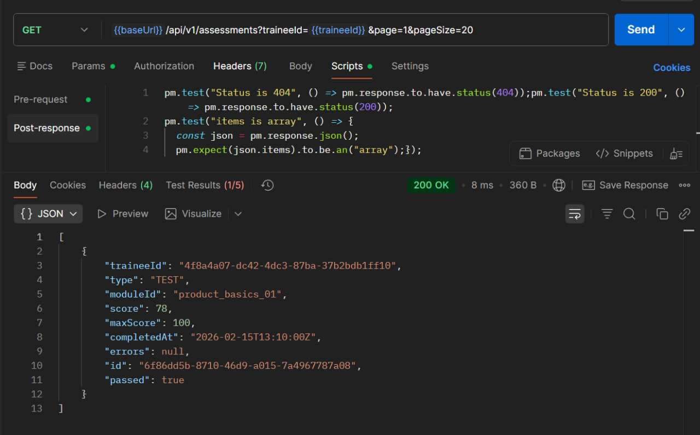
### Тест 7.2 (негативный): неправильный формат
- **Метод:** GET  
- **URL:** `{{baseUrl}}/api/v1/assessments?type=WRONG`

**Ожидаем:** `422`

**Tests:**
```javascript
pm.test("Status is 422", function () {
    pm.response.to.have.status(422);
});
```
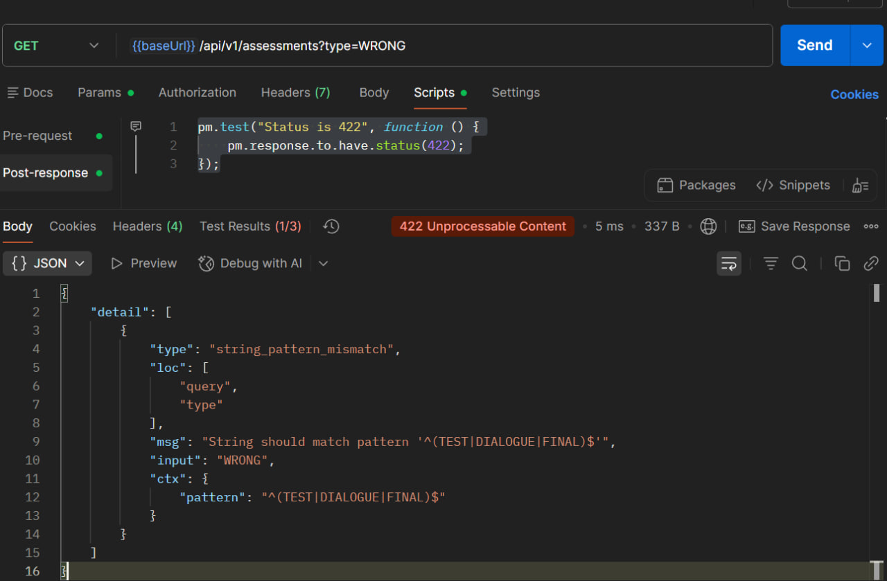


---

## 8) GET /api/v1/metrics/trainees/{traineeId} — Get Metrics

### Тест 8.1 (позитивный): метрики по traineeId
- **Метод:** GET  
- **URL:** `{{baseUrl}}/api/v1/metrics/trainees/{{traineeId}}?from=2026-02-01&to=2026-02-29`

**Ожидаем:** `200`, есть  `avgScore`

**Tests:**
```javascript
pm.test("Status is 200", () => pm.response.to.have.status(200));
pm.test("Has avgScore and riskLevel", () => {
  const json = pm.response.json();
  pm.expect(json).to.have.property("avgScore");
  pm.expect(json).to.have.property("riskLevel");
});
```
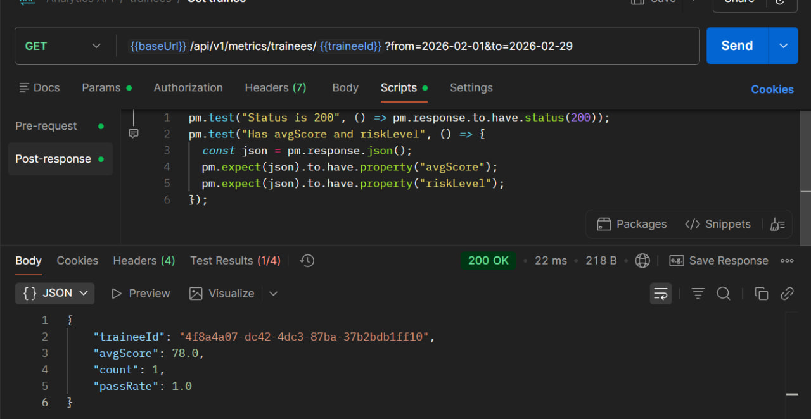
### Тест 8.2 (негативный): метрики по несуществующему traineeId
- **Метод:** GET  
- **URL:** `{{baseUrl}}/api/v1/metrics/trainees/00000000-0000-0000-0000-000000000000`

**Ожидаем:** `404`

**Tests:**
```javascript
pm.test("Status is 404", () => pm.response.to.have.status(404));
```

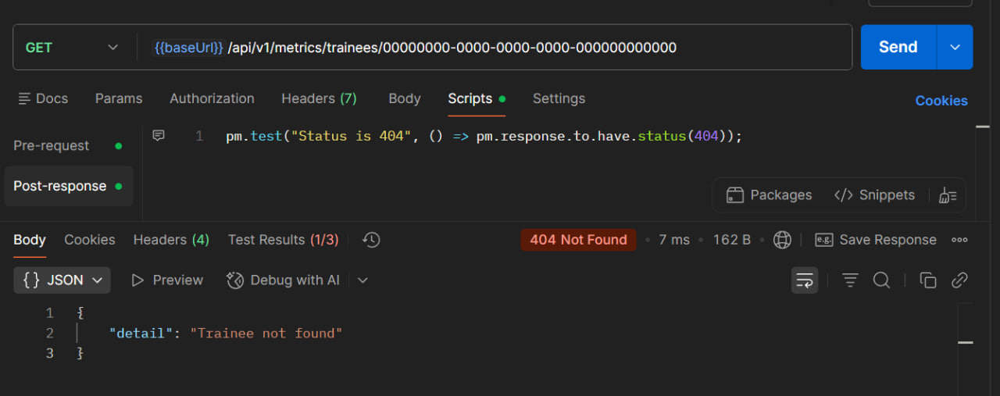

---


В рамках лабораторной работы спроектирован REST API для сервиса аналитики адаптации менеджеров по продажам, описаны решения проектирования (версионирование, форматы ошибок, коды ответов, пагинация, аутентификация и т.д.), реализован набор эндпоинтов (GET/POST/PUT/DELETE) и подготовлен план тестирования в Postman с автотестами для каждого endpoint (минимум 2 теста на endpoint).

