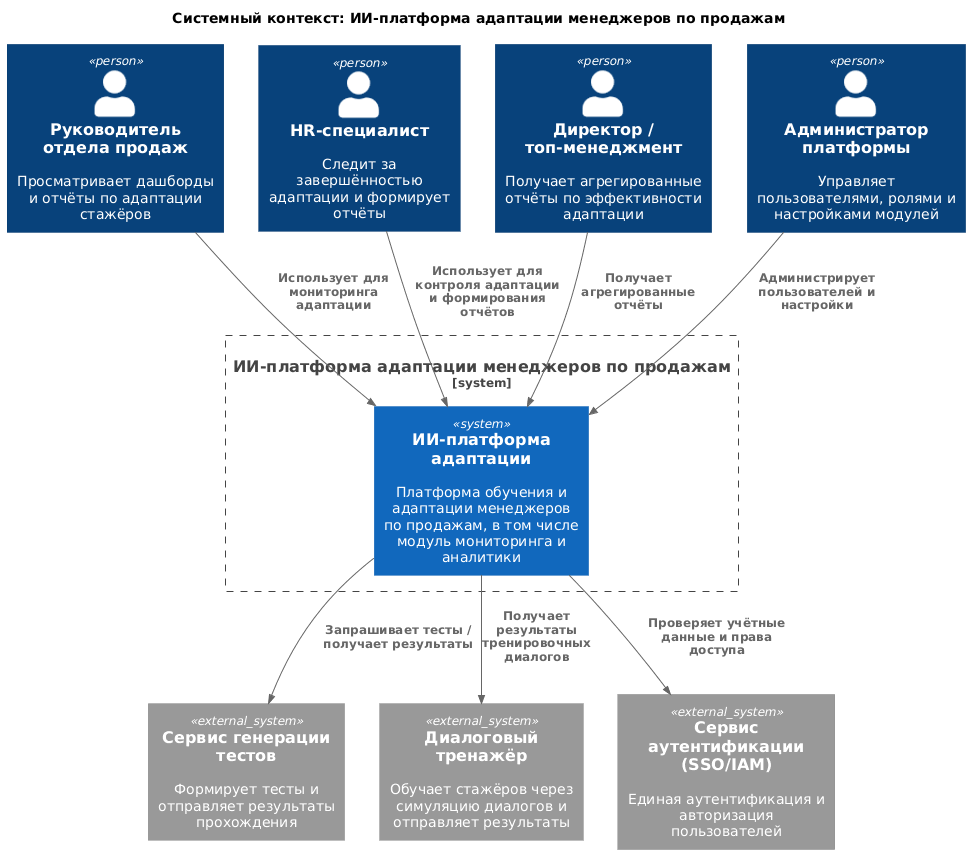
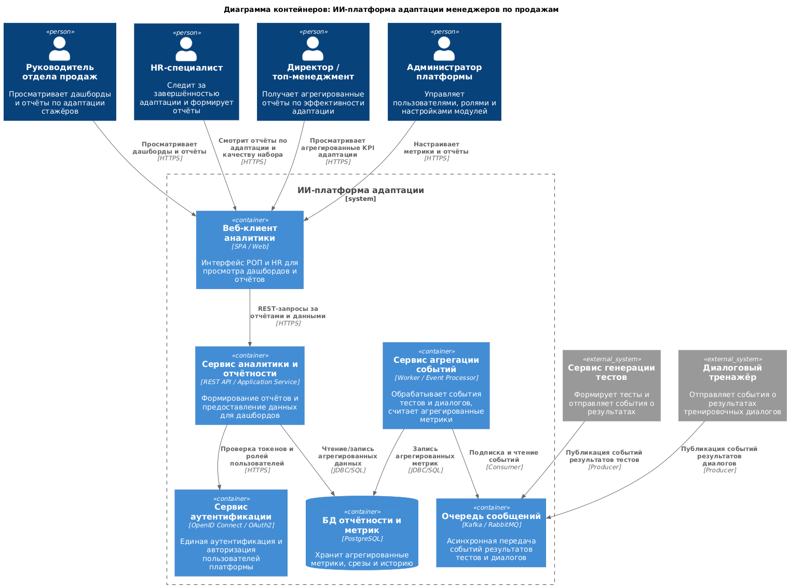
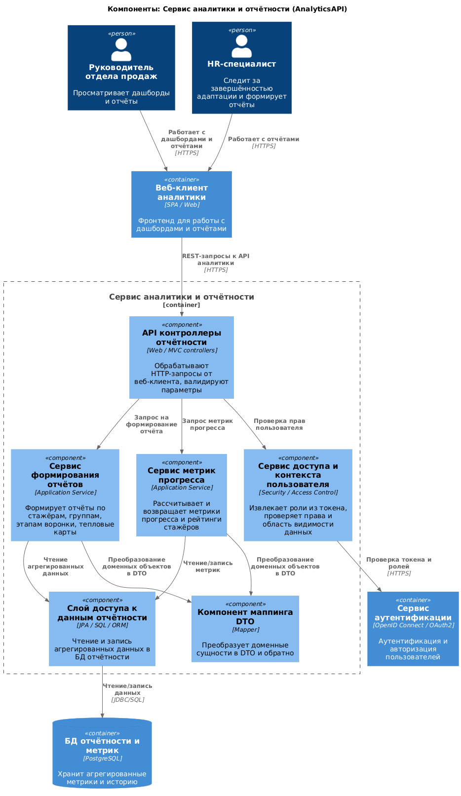

# Лабораторная работа №2  
**Тема:** Использование нотации C4 model для проектирования архитектуры программной системы  

**Вариант / предметная область:**  
«Система мониторинга и аналитики эффективности адаптации менеджеров по продажам в ИИ‑платформе обучения персонала»

**Цель работы:**  
Получить опыт использования графической нотации C4 для фиксации архитектурных решений по модулю мониторинга и аналитики.

## 1. Диаграмма системного контекста (C1)

На уровне системного контекста рассматривается ИИ‑платформа адаптации менеджеров по продажам в целом, а модуль мониторинга и аналитики выступает как часть этой системы.  

Основные участники:

- Руководитель отдела продаж — просматривает дашборды и отчёты по адаптации стажёров.  
- HR‑специалист — следит за завершённостью адаптации и качеством набора.  
- Директор / топ‑менеджмент — получает агрегированную отчётность по эффективности адаптации.  
- Администратор платформы — управляет пользователями и настройками модулей.  

Внешние системы:

- Сервис генерации тестов — поставляет результаты тестирования.  
- Диалоговый тренажёр — поставляет результаты тренировочных диалогов.  
- Сервис аутентификации — обеспечивает единый вход (SSO) и авторизацию.

## 2. Диаграмма контейнеров (C2)

На уровне контейнеров показываются основные части ИИ‑платформы адаптации, которые развертываются и взаимодействуют по сети.

Внутри системы выделены контейнеры:

- **Веб‑клиент аналитики (AnalyticsWebUI)** — SPA/веб‑интерфейс для РОП и HR.  
- **Сервис аналитики и отчётности (AnalyticsAPI)** — backend с REST API для дашбордов и отчётов.  
- **Сервис агрегации событий (IngestionService)** — фоновый сервис, который читает события из очереди и обновляет агрегированные метрики.  
- **БД отчётности и метрик (ReportingDB)** — отдельная база данных для аналитической информации.  
- **Очередь сообщений (MessageBus)** — асинхронный обмен событиями между модулями.  
- **Сервис аутентификации (AuthService)** — единый SSO/Authorization‑сервис.

Внешние системы:

- Сервис генерации тестов и диалоговый тренажёр публикуют события (результаты) в очередь сообщений.

Архитектурный стиль: распределённое веб‑приложение с асинхронной обработкой событий.

## 3. Диаграмма компонентов (C3)

### 3.1 Компоненты сервиса аналитики и отчётности

- `ReportingApiControllers` — контроллеры REST API, обработка запросов от веб‑клиента.  
- `ReportingService` — бизнес‑логика формирования отчётов (по стажёрам, группам, этапам воронки, тепловые карты).  
- `ProgressMetricsService` — расчёт и предоставление метрик прогресса адаптации и рейтингов.  
- `UserContextService` — работа с контекстом пользователя и проверкой прав доступа.  
- `ReportingRepository` — слой доступа к данным (БД отчётности и метрик).  
- `DtoMapper` — преобразование сущностей в DTO и обратно.

### 3.2 Компоненты сервиса агрегации событий

- `TestEventsSubscriber` — подписчик событий результатов тестов.  
- `DialogueEventsSubscriber` — подписчик событий результатов диалогов.  
- `AggregationOrchestrator` — оркестрация обработки событий.  
- `MetricsAggregator` — расчёт агрегированных метрик по стажёрам, группам и этапам.  
- `IngestionRepository` — запись/обновление агрегированных метрик в БД отчётности.

