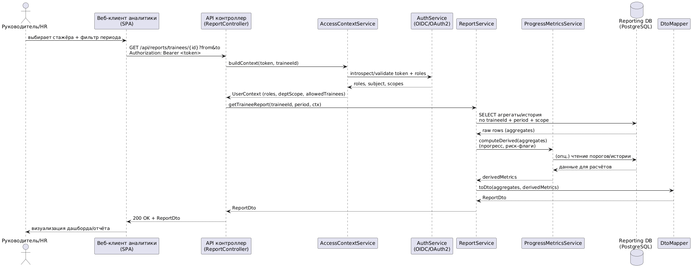
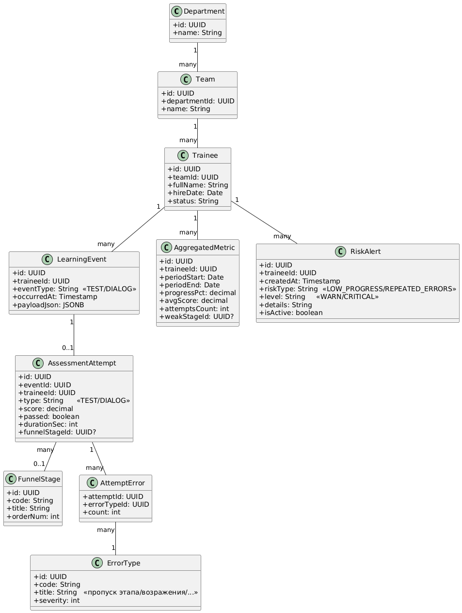

# Лабораторная работа №3  
## Тема: Использование принципов проектирования на уровне методов и классов  
**Цель:** получить опыт проектирования и реализации модулей с использованием принципов KISS, YAGNI, DRY, SOLID и др.
### Вариант использования: «Просмотр отчёта прогресса стажёра с фильтрами»
**Актор:** Руководитель/HR  
**Результат:** UI получает структурированный отчёт (прогресс, динамика, проблемные зоны, риск-флаг

## Диаграмма контейнеров (C4)

Детализируемый далее контейнер: **Сервис аналитики и отчётности (AnalyticsAPI)**.


## Диаграмма компонентов (C4) — контейнер AnalyticsAPI

 

## Диаграмма последовательностей (выбранный вариант использования)



## Модель БД (UML диаграмма классов)

Модель агрегированного хранилища (PostgreSQL), ориентированного на отчётность.



**Кратко по назначению сущностей:**
- **LearningEvent** — сырьевые события из очереди (аудит/трассировка, возможность переагрегации).
- **AssessmentAttempt / AttemptError** — нормализованные результаты попыток и ошибок.
- **AggregatedMetric** — заранее посчитанные метрики для быстрых отчётов.
- **RiskAlert** — материализованные риски для уведомлений/фильтров.
- **Department/Team/Trainee** — оргконтекст и область видимости данных.

---

## Применение основных принципов разработки (код + пояснения)

Ниже MVP-фрагменты: один отчёт по стажёру с фильтром периода.

### Сервер (пример: Java + Spring Boot)

#### 1) Контроллер (SRP, KISS)
```java
@RestController
@RequestMapping("/api/reports")
@RequiredArgsConstructor
public class ReportController {

  private final AccessContextService accessContextService;
  private final ReportService reportService;

  @GetMapping("/trainees/{traineeId}")
  public TraineeReportDto getTraineeReport(
      @PathVariable UUID traineeId,
      @RequestParam LocalDate from,
      @RequestParam LocalDate to,
      @RequestHeader("Authorization") String authHeader
  ) {
    var token = BearerToken.parse(authHeader); // KISS: маленький парсер
    var ctx = accessContextService.buildContext(token, traineeId); // SRP: права отдельно
    return reportService.getTraineeReport(traineeId, new Period(from, to), ctx);
  }
}
```

- **SRP:** контроллер только принимает вход и делегирует.
- **KISS:** один endpoint без лишней универсализации.

#### 2) Контекст доступа (DIP, SRP, SoC)
```java
public interface AccessContextService {
  UserContext buildContext(BearerToken token, UUID traineeId);
}

@Service
@RequiredArgsConstructor
public class AccessContextServiceImpl implements AccessContextService {

  private final AuthGateway authGateway;         // DIP: интерфейс
  private final TraineeScopePolicy scopePolicy;  // SRP: политика видимости отдельно

  @Override
  public UserContext buildContext(BearerToken token, UUID traineeId) {
    var principal = authGateway.validate(token); // токен/роли
    scopePolicy.assertCanView(principal, traineeId); // права на trainee
    return UserContext.of(principal.userId(), principal.roles(), principal.departmentScope());
  }
}
```

#### 3) Сервис отчёта (OCP, DRY, SRP)
```java
public interface ReportService {
  TraineeReportDto getTraineeReport(UUID traineeId, Period period, UserContext ctx);
}

@Service
@RequiredArgsConstructor
public class ReportServiceImpl implements ReportService {

  private final ReportRepository reportRepository;
  private final ProgressMetricsService metricsService;
  private final ReportMapper mapper;

  @Override
  public TraineeReportDto getTraineeReport(UUID traineeId, Period period, UserContext ctx) {
    var aggregates = reportRepository.loadAggregates(traineeId, period, ctx.departmentScope());
    var derived = metricsService.computeDerived(aggregates);
    return mapper.toDto(aggregates, derived);
  }
}
```

- **DRY:** сборка отчёта — единая точка, логика не дублируется в контроллере/репозитории.

#### 4) Метрики и риск-правила (OCP + Strategy, ISP)
```java
public record DerivedMetrics(
    BigDecimal progressPct,
    BigDecimal riskScore,
    List<String> weakZones
) {}

public interface ProgressMetricsService {
  DerivedMetrics computeDerived(AggregatesView view);
}

public interface RiskRule { // ISP: узкий интерфейс
  Optional<String> check(AggregatesView view);
}

@Service
@RequiredArgsConstructor
public class ProgressMetricsServiceImpl implements ProgressMetricsService {

  private final List<RiskRule> rules; // OCP: добавляем правила без правок сервиса

  @Override
  public DerivedMetrics computeDerived(AggregatesView view) {
    var weakZones = rules.stream()
        .map(r -> r.check(view))
        .flatMap(Optional::stream)
        .toList();

    var riskScore = BigDecimal.valueOf(weakZones.size()).min(BigDecimal.TEN);
    return new DerivedMetrics(view.progressPct(), riskScore, weakZones);
  }
}

@Component
public class LowProgressRule implements RiskRule {
  @Override public Optional<String> check(AggregatesView view) {
    return view.progressPct().compareTo(BigDecimal.valueOf(40)) < 0
        ? Optional.of("Низкий прогресс (<40%)")
        : Optional.empty();
  }
}

@Component
public class RepeatedErrorsRule implements RiskRule {
  @Override public Optional<String> check(AggregatesView view) {
    return view.repeatedErrorsCount() >= 5
        ? Optional.of("Повторяющиеся ошибки (>=5)")
        : Optional.empty();
  }
}
```

- **OCP:** новое правило риска = новый класс `RiskRule`, без правок существующего сервиса.
- **ISP:** правило — узкий контракт.
- **KISS:** расчёт риска упрощён для демонстрации принципов.

#### 5) Репозиторий (DIP, SRP)
```java
public interface ReportRepository {
  AggregatesView loadAggregates(UUID traineeId, Period period, UUID deptScope);
}

@Repository
@RequiredArgsConstructor
public class JdbcReportRepository implements ReportRepository {

  private final NamedParameterJdbcTemplate jdbc;

  @Override
  public AggregatesView loadAggregates(UUID traineeId, Period period, UUID deptScope) {
    // KISS: один запрос под отчёт (без раннего “универсального query builder”)
    String sql =
        "SELECT progress_pct, avg_score, attempts_count, repeated_errors_count " +
        "FROM aggregated_metrics " +
        "WHERE trainee_id = :traineeId " +
        "  AND period_start >= :from AND period_end <= :to";

    var params = Map.of("traineeId", traineeId, "from", period.from(), "to", period.to());

    return jdbc.queryForObject(sql, params, (rs, rowNum) -> new AggregatesView(
        rs.getBigDecimal("progress_pct"),
        rs.getBigDecimal("avg_score"),
        rs.getInt("attempts_count"),
        rs.getInt("repeated_errors_count")
    ));
  }
}
```

---

### Клиент (пример: React + TypeScript)

#### DRY: единый API-клиент + типы DTO
```ts
export type TraineeReportDto = {
  traineeId: string;
  period: { from: string; to: string };
  progressPct: number;
  avgScore: number;
  riskScore: number;
  weakZones: string[];
};

async function apiGet<T>(url: string, token: string): Promise<T> {
  const res = await fetch(url, { headers: { Authorization: `Bearer ${token}` } });
  if (!res.ok) throw new Error(`HTTP ${res.status}`);
  return res.json() as Promise<T>;
}

export function loadTraineeReport(
  traineeId: string,
  from: string,
  to: string,
  token: string
) {
  const url = `/api/reports/trainees/${traineeId}?from=${from}&to=${to}`;
  return apiGet<TraineeReportDto>(url, token);
}
```

#### KISS: компонент отчёта без лишних абстракций
```tsx
import React, { useEffect, useState } from "react";
import { loadTraineeReport, TraineeReportDto } from "./api";

export function TraineeReportView(props: {
  traineeId: string;
  from: string;
  to: string;
  token: string;
}) {
  const [data, setData] = useState<TraineeReportDto | null>(null);
  const [error, setError] = useState<string | null>(null);

  useEffect(() => {
    loadTraineeReport(props.traineeId, props.from, props.to, props.token)
      .then(setData)
      .catch((e) => setError(String(e)));
  }, [props.traineeId, props.from, props.to, props.token]);

  if (error) return <div>Ошибка: {error}</div>;
  if (!data) return <div>Загрузка...</div>;

  return (
    <div>
      <h3>Прогресс: {data.progressPct}%</h3>
      <div>Средний балл: {data.avgScore}</div>
      <div>Риск: {data.riskScore}/10</div>
      <ul>
        {data.weakZones.map((z) => (
          <li key={z}>{z}</li>
        ))}
      </ul>
    </div>
  );
}
```

---

## Как учтены KISS, YAGNI, DRY, SOLID

- **KISS:** минимальный сценарий отчёта (1 endpoint + один запрос), простые DTO и риск-правила.
- **YAGNI:** не внедряются заранее CQRS, event-sourcing, сложные универсальные фильтры/конструкторы запросов, “движки отчётов”.
- **DRY:** общий `apiGet<T>()`, единый `ReportService` для сборки отчёта, переиспользуемые правила `RiskRule`.
- **SOLID:**
  - **SRP:** контроллер ≠ права ≠ отчёт ≠ метрики ≠ доступ к данным.
  - **OCP:** риск-логика расширяется через новые реализации `RiskRule`.
  - **LSP:** реализации сервисов подставляемы через интерфейсы без нарушения контрактов.
  - **ISP:** интерфейсы узкие (`RiskRule`, `ReportRepository`).
  - **DIP:** зависимости направлены на абстракции и внедряются через DI.

---

## Дополнительные принципы разработки (повышенная сложность)

### BDUF — Big Design Up Front
**Применимость:** частично.  
Имеет смысл заранее определить контейнеры, потоки событий и хранилище агрегатов (дорого переделывать), но детальный дизайн всех отчётов заранее делать невыгодно из‑за изменчивости требований аналитики.  
**Вывод:** BDUF применяем на уровне **контейнеров и потоков данных**, избегаем чрезмерной детализации конкретных отчётов.

### SoC — Separation of Concerns (разделение ответственности)
**Применимость:** да.  
Отчётность, безопасность, ingestion/агрегация, хранение и UI — разные задачи с разной частотой изменений. Разделение снижает связность и упрощает поддержку.  
**Вывод:** активно применяем (слои, сервисы, репозитории, отдельный ingestion-контейнер).

### MVP — Minimum Viable Product
**Применимость:** да.  
Бизнесу важно быстро получить ценность: базовый отчёт по стажёру + риск-флаги. Это позволяет проверить гипотезы и собрать обратную связь без “идеальной” аналитики.  
**Вывод:** стартуем с MVP: базовые метрики + фильтр периода + простые риски.

### PoC — Proof of Concept
**Применимость:** да (на раннем этапе).  
Есть технические риски: корректность агрегации событий, нагрузка очереди, точность метрик и “типовых ошибок”. PoC доказывает жизнеспособность цепочки (события → агрегаты → отчёт).  
**Вывод:** PoC полезен до полноценной разработки: ingestion + один отчёт.
