# Лабораторная работа №6  
## Тема: Использование шаблонов проектирования

**Цель работы:** получить опыт применения шаблонов проектирования при написании кода программной системы.

---

# Шаблоны проектирования GoF

## 1. Порождающие шаблоны

### 1.1. Factory Method

**Общее назначение.**  
Factory Method выносит создание объектов в отдельный метод, позволяя выбирать конкретный класс создаваемого объекта без жёсткой привязки клиентского кода к реализации.

**Назначение в проекте.**  
В аналитическом модуле один и тот же API может строить разные виды отчётов: по сотруднику, по команде, по периоду. Контроллеру не нужно знать, какой именно класс отчёта создавать — он обращается к фабричному методу.

**Фрагмент кода.**
```python
from abc import ABC, abstractmethod

class Report(ABC):
    @abstractmethod
    def build(self, payload: dict) -> dict:
        pass


class EmployeeReport(Report):
    def build(self, payload: dict) -> dict:
        return {
            "type": "employee",
            "employee_id": payload["employee_id"],
            "metrics": payload["metrics"],
        }


class TeamReport(Report):
    def build(self, payload: dict) -> dict:
        return {
            "type": "team",
            "team_id": payload["team_id"],
            "summary": payload["summary"],
        }


class ReportCreator(ABC):
    @abstractmethod
    def factory_method(self) -> Report:
        pass

    def create_report(self, payload: dict) -> dict:
        report = self.factory_method()
        return report.build(payload)


class EmployeeReportCreator(ReportCreator):
    def factory_method(self) -> Report:
        return EmployeeReport()


class TeamReportCreator(ReportCreator):
    def factory_method(self) -> Report:
        return TeamReport()
```

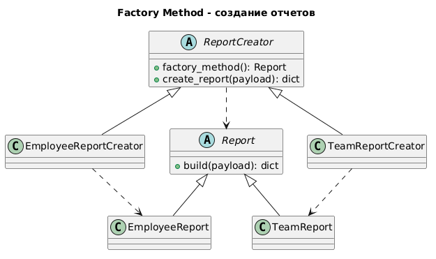

### 1.2. Builder

**Общее назначение.**  
Builder позволяет пошагово собирать сложный объект, отделяя процесс конструирования от конечного представления.

**Назначение в проекте.**  
Дашборд сотрудника состоит из нескольких независимых частей: карточка менеджера, индекс адаптации, график динамики, ошибки, история активности. Builder удобен для поэтапной сборки такого DTO.

**Фрагмент кода.**
```python
class DashboardBuilder:
    def __init__(self):
        self._dashboard = {}

    def add_profile(self, profile: dict):
        self._dashboard["profile"] = profile
        return self

    def add_index(self, adaptation_index: float):
        self._dashboard["adaptation_index"] = adaptation_index
        return self

    def add_dynamics(self, points: list[dict]):
        self._dashboard["dynamics"] = points
        return self

    def add_errors(self, heatmap: list[dict]):
        self._dashboard["errors_heatmap"] = heatmap
        return self

    def add_activity(self, activity: list[dict]):
        self._dashboard["activity_history"] = activity
        return self

    def build(self) -> dict:
        return self._dashboard


class DashboardDirector:
    def __init__(self, builder: DashboardBuilder):
        self.builder = builder

    def make_employee_dashboard(
        self,
        profile: dict,
        adaptation_index: float,
        dynamics: list[dict],
        errors: list[dict],
        activity: list[dict],
    ) -> dict:
        return (
            self.builder
            .add_profile(profile)
            .add_index(adaptation_index)
            .add_dynamics(dynamics)
            .add_errors(errors)
            .add_activity(activity)
            .build()
        )
```

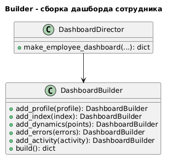

---

### 1.3. Singleton

**Общее назначение.**  
Singleton гарантирует наличие одного экземпляра класса и предоставляет к нему глобальную точку доступа.

**Назначение в проекте.**  
Для подключения к БД и конфигурации аналитического модуля удобно иметь единый объект настроек и клиента подключения, чтобы не создавать их заново в каждом сервисе.

**Фрагмент кода.**
```python
class DatabaseConfig:
    _instance = None

    def __new__(cls, dsn: str):
        if cls._instance is None:
            cls._instance = super().__new__(cls)
            cls._instance.dsn = dsn
        return cls._instance


db_config_1 = DatabaseConfig("postgresql://user:pass@db:5432/analytics")
db_config_2 = DatabaseConfig("another_dsn")

assert db_config_1 is db_config_2
assert db_config_2.dsn == "postgresql://user:pass@db:5432/analytics"
```

**PlantUML-код диаграммы.**
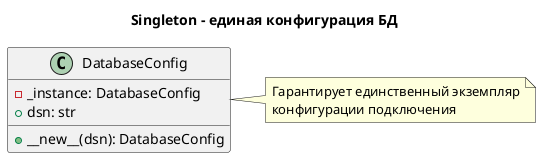

---

## 2. Структурные шаблоны

### 2.1. Adapter

**Общее назначение.**  
Adapter преобразует интерфейс одного класса в интерфейс, ожидаемый клиентом.

**Назначение в проекте.**  
Результаты из тестового модуля, диалогового тренажёра и итоговой аттестации могут приходить в разном формате. Adapter приводит их к единому виду `NormalizedAttempt`.

**Фрагмент кода.**
```python
class NormalizedAttempt:
    def __init__(self, employee_id: int, topic: str, score: float, source: str):
        self.employee_id = employee_id
        self.topic = topic
        self.score = score
        self.source = source


class TrainerResultAdapter:
    def convert(self, raw: dict) -> NormalizedAttempt:
        return NormalizedAttempt(
            employee_id=raw["userId"],
            topic=raw["skillName"],
            score=raw["successRate"],
            source="trainer",
        )


class TestResultAdapter:
    def convert(self, raw: dict) -> NormalizedAttempt:
        return NormalizedAttempt(
            employee_id=raw["employee_id"],
            topic=raw["topic"],
            score=raw["percent"],
            source="test",
        )
```

**PlantUML-код диаграммы.**
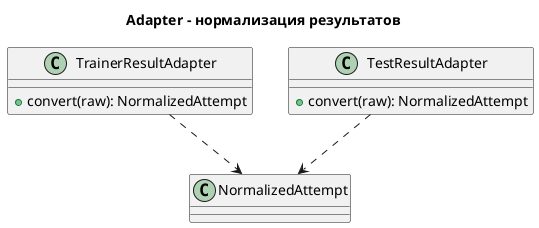

---

### 2.2. Facade

**Общее назначение.**  
Facade предоставляет единый упрощённый интерфейс к сложной подсистеме.

**Назначение в проекте.**  
Для построения аналитики контроллеру не нужно по отдельности вызывать репозиторий метрик, сервис индекса, сервис ошибок и сервис уведомлений. Всё это можно скрыть за фасадом `AnalyticsFacade`.

**Фрагмент кода.**
```python
class MetricsRepository:
    def get_employee_metrics(self, employee_id: int) -> dict:
        return {"tests_avg": 84, "trainer_avg": 76, "deals_stage_passed": 0.7}


class AdaptationIndexService:
    def calculate(self, metrics: dict) -> float:
        return round(
            metrics["tests_avg"] * 0.4
            + metrics["trainer_avg"] * 0.4
            + metrics["deals_stage_passed"] * 100 * 0.2,
            2,
        )


class ErrorAnalyticsService:
    def get_heatmap(self, employee_id: int) -> list[dict]:
        return [{"topic": "Возражения", "errors": 4}]


class AnalyticsFacade:
    def __init__(
        self,
        metrics_repo: MetricsRepository,
        index_service: AdaptationIndexService,
        error_service: ErrorAnalyticsService,
    ):
        self.metrics_repo = metrics_repo
        self.index_service = index_service
        self.error_service = error_service

    def build_employee_snapshot(self, employee_id: int) -> dict:
        metrics = self.metrics_repo.get_employee_metrics(employee_id)
        return {
            "metrics": metrics,
            "adaptation_index": self.index_service.calculate(metrics),
            "errors": self.error_service.get_heatmap(employee_id),
        }
```

**PlantUML-код диаграммы.**
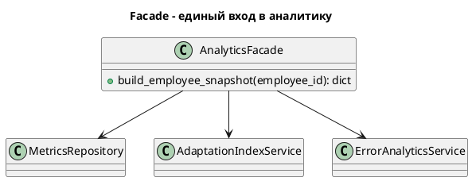

---

### 2.3. Decorator

**Общее назначение.**  
Decorator динамически добавляет объекту новое поведение без изменения его базового класса.

**Назначение в проекте.**  
К построению отчёта можно добавлять сквозные функции: логирование, проверку прав доступа, кеширование, измерение времени расчёта.

**Фрагмент кода.**
```python
from abc import ABC, abstractmethod
from time import perf_counter

class ReportService(ABC):
    @abstractmethod
    def generate(self, employee_id: int) -> dict:
        pass


class BaseReportService(ReportService):
    def generate(self, employee_id: int) -> dict:
        return {"employee_id": employee_id, "report": "ok"}


class ReportServiceDecorator(ReportService):
    def __init__(self, wrapped: ReportService):
        self.wrapped = wrapped


class TimingDecorator(ReportServiceDecorator):
    def generate(self, employee_id: int) -> dict:
        start = perf_counter()
        result = self.wrapped.generate(employee_id)
        result["elapsed_ms"] = round((perf_counter() - start) * 1000, 2)
        return result


class LoggingDecorator(ReportServiceDecorator):
    def generate(self, employee_id: int) -> dict:
        print(f"Generate report for employee={employee_id}")
        return self.wrapped.generate(employee_id)
```

**PlantUML-код диаграммы.**
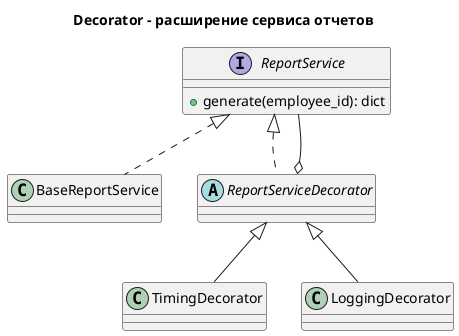

---

### 2.4. Proxy

**Общее назначение.**  
Proxy подставляет объект-заместитель, который контролирует доступ к реальному объекту.

**Назначение в проекте.**  
Тяжёлые аналитические запросы можно оборачивать прокси с кешированием, чтобы не пересчитывать одни и те же данные при повторных запросах.

**Фрагмент кода.**
```python
class TeamAnalyticsService:
    def get_team_dashboard(self, team_id: int) -> dict:
        print("Heavy SQL / aggregation")
        return {"team_id": team_id, "avg_index": 78.4}


class CachedTeamAnalyticsProxy:
    def __init__(self, service: TeamAnalyticsService):
        self.service = service
        self.cache = {}

    def get_team_dashboard(self, team_id: int) -> dict:
        if team_id not in self.cache:
            self.cache[team_id] = self.service.get_team_dashboard(team_id)
        return self.cache[team_id]
```

**PlantUML-код диаграммы.**
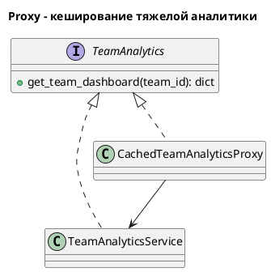

---

## 3. Поведенческие шаблоны

### 3.1. Strategy

**Общее назначение.**  
Strategy позволяет определять семейство алгоритмов, инкапсулировать каждый из них и делать их взаимозаменяемыми.

**Назначение в проекте.**  
Индекс адаптации можно считать по-разному: базовая формула, усиленный акцент на диалоговые тренажёры, формула для испытательного срока и т.д.

**Фрагмент кода.**
```python
from abc import ABC, abstractmethod

class AdaptationStrategy(ABC):
    @abstractmethod
    def calculate(self, metrics: dict) -> float:
        pass


class BasicAdaptationStrategy(AdaptationStrategy):
    def calculate(self, metrics: dict) -> float:
        return round(metrics["tests"] * 0.5 + metrics["trainer"] * 0.5, 2)


class SalesFocusStrategy(AdaptationStrategy):
    def calculate(self, metrics: dict) -> float:
        return round(
            metrics["tests"] * 0.3
            + metrics["trainer"] * 0.4
            + metrics["calls"] * 0.3,
            2,
        )


class AdaptationIndexContext:
    def __init__(self, strategy: AdaptationStrategy):
        self.strategy = strategy

    def set_strategy(self, strategy: AdaptationStrategy):
        self.strategy = strategy

    def execute(self, metrics: dict) -> float:
        return self.strategy.calculate(metrics)
```

**PlantUML-код диаграммы.**
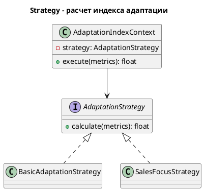

---

### 3.2. Observer

**Общее назначение.**  
Observer задаёт зависимость «один ко многим», при которой изменение состояния одного объекта уведомляет всех зависимых наблюдателей.

**Назначение в проекте.**  
Если индекс адаптации падает ниже порога или ошибки повторяются слишком часто, нужно автоматически отправлять уведомления руководителю, HR и, например, в журнал мониторинга.

**Фрагмент кода.**
```python
from abc import ABC, abstractmethod

class Observer(ABC):
    @abstractmethod
    def update(self, event: dict):
        pass


class HRNotifier(Observer):
    def update(self, event: dict):
        print(f"HR notified: {event}")


class TeamLeadNotifier(Observer):
    def update(self, event: dict):
        print(f"TeamLead notified: {event}")


class RiskMonitor:
    def __init__(self):
        self._observers: list[Observer] = []

    def attach(self, observer: Observer):
        self._observers.append(observer)

    def notify(self, event: dict):
        for observer in self._observers:
            observer.update(event)

    def handle_risk(self, employee_id: int, adaptation_index: float):
        if adaptation_index < 60:
            self.notify({
                "employee_id": employee_id,
                "risk": "low_adaptation_index",
                "value": adaptation_index,
            })
```

**PlantUML-код диаграммы.**
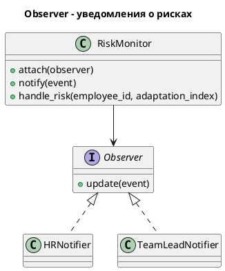

---

### 3.3. Command

**Общее назначение.**  
Command инкапсулирует запрос как объект, позволяя параметризовать клиентов операциями, ставить задачи в очередь и логировать вызовы.

**Назначение в проекте.**  
Пересчёт витрины, сбор дневной статистики, построение отчёта и повторная агрегация по команде можно оформить как команды и вызывать единообразно.

**Фрагмент кода.**
```python
from abc import ABC, abstractmethod

class Command(ABC):
    @abstractmethod
    def execute(self):
        pass


class RebuildDailyMetricsCommand(Command):
    def __init__(self, mart_service):
        self.mart_service = mart_service

    def execute(self):
        self.mart_service.rebuild_daily_metrics()


class GenerateEmployeeReportCommand(Command):
    def __init__(self, report_service, employee_id: int):
        self.report_service = report_service
        self.employee_id = employee_id

    def execute(self):
        return self.report_service.generate(self.employee_id)


class CommandInvoker:
    def run(self, command: Command):
        return command.execute()
```

**PlantUML-код диаграммы.**
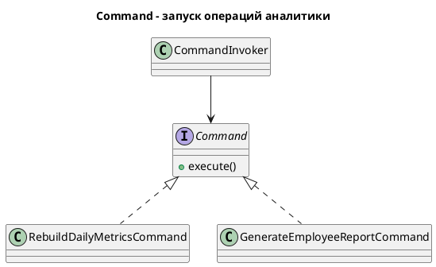

---

### 3.4. Template Method

**Общее назначение.**  
Template Method задаёт каркас алгоритма в базовом классе, оставляя часть шагов подклассам.

**Назначение в проекте.**  
Построение разных отчётов проходит по единому сценарию: загрузка данных, валидация, расчёт метрик, сериализация результата. Отличаются только конкретные реализации шагов.

**Фрагмент кода.**
```python
from abc import ABC, abstractmethod

class AbstractAnalyticsReport(ABC):
    def build_report(self, entity_id: int) -> dict:
        raw = self.load_data(entity_id)
        validated = self.validate(raw)
        metrics = self.calculate_metrics(validated)
        return self.serialize(metrics)

    @abstractmethod
    def load_data(self, entity_id: int):
        pass

    def validate(self, raw):
        if raw is None:
            raise ValueError("No data")
        return raw

    @abstractmethod
    def calculate_metrics(self, raw):
        pass

    def serialize(self, metrics):
        return {"result": metrics}


class EmployeeAnalyticsReport(AbstractAnalyticsReport):
    def load_data(self, entity_id: int):
        return {"employee_id": entity_id, "score": 78}

    def calculate_metrics(self, raw):
        return {"adaptation_index": raw["score"]}
```

**PlantUML-код диаграммы.**
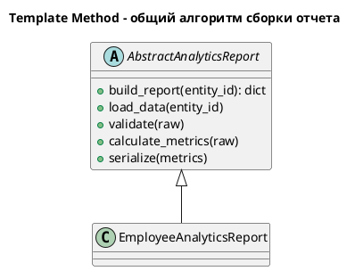

---

### 3.5. State

**Общее назначение.**  
State позволяет объекту менять поведение при изменении внутреннего состояния.

**Назначение в проекте.**  
Стажёр может находиться в состояниях: «Новый», «В процессе адаптации», «В зоне риска», «Адаптирован». От состояния зависит доступная логика и рекомендации.

**Фрагмент кода.**
```python
from abc import ABC, abstractmethod

class AdaptationState(ABC):
    @abstractmethod
    def handle(self, trainee: "Trainee"):
        pass


class NewState(AdaptationState):
    def handle(self, trainee: "Trainee"):
        trainee.status = "new"
        if trainee.index >= 40:
            trainee.set_state(InProgressState())


class InProgressState(AdaptationState):
    def handle(self, trainee: "Trainee"):
        trainee.status = "in_progress"
        if trainee.index < 40:
            trainee.set_state(RiskState())
        elif trainee.index >= 80:
            trainee.set_state(AdaptedState())


class RiskState(AdaptationState):
    def handle(self, trainee: "Trainee"):
        trainee.status = "risk"


class AdaptedState(AdaptationState):
    def handle(self, trainee: "Trainee"):
        trainee.status = "adapted"


class Trainee:
    def __init__(self, index: float):
        self.index = index
        self.state: AdaptationState = NewState()
        self.status = "new"

    def set_state(self, state: AdaptationState):
        self.state = state

    def process(self):
        self.state.handle(self)
```

**PlantUML-код диаграммы.**
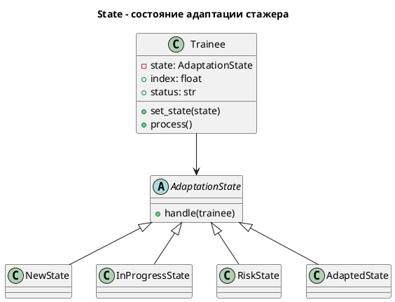

---

# Шаблоны проектирования GRASP

## 1. Роли (обязанности) классов

### 1.1. Information Expert

**Проблема.**  
Нужно определить, какой класс должен рассчитывать индекс адаптации и производные метрики.

**Решение.**  
Ответственность передаётся тому классу, который владеет необходимыми данными или работает с ними напрямую. В данном проекте это `AdaptationIndexService`, получающий агрегированные метрики.

**Пример кода.**
```python
class AdaptationIndexService:
    def calculate(self, metrics: dict) -> float:
        return round(
            metrics["tests_avg"] * 0.4 +
            metrics["trainer_avg"] * 0.4 +
            metrics["pipeline_pass_rate"] * 100 * 0.2,
            2
        )
```

**Результат.**  
Логика расчёта сосредоточена в одном месте, код проще тестировать и менять.

**Связь с другими паттернами.**  
Хорошо сочетается со Strategy и Facade.

---

### 1.2. Creator

**Проблема.**  
Нужно определить, какой класс должен создавать сложный объект дашборда.

**Решение.**  
Создание передаётся классу, который агрегирует его части и тесно с ним связан. В проекте это `DashboardDirector` и `DashboardBuilder`.

**Пример кода.**
```python
class DashboardDirector:
    def __init__(self, builder: DashboardBuilder):
        self.builder = builder

    def make_employee_dashboard(self, profile, adaptation_index, dynamics, errors, activity):
        return (
            self.builder
            .add_profile(profile)
            .add_index(adaptation_index)
            .add_dynamics(dynamics)
            .add_errors(errors)
            .add_activity(activity)
            .build()
        )
```

**Результат.**  
Создание сложного DTO убирается из контроллера и становится управляемым.

**Связь с другими паттернами.**  
Напрямую связан с Builder.

---

### 1.3. Controller

**Проблема.**  
Нужен объект, который будет принимать системные события от API и координировать действия доменных сервисов.

**Решение.**  
Контроллер получает запрос, валидирует входные данные и вызывает фасад или сервисы.

**Пример кода.**
```python
class AnalyticsController:
    def __init__(self, facade: AnalyticsFacade):
        self.facade = facade

    def get_employee_dashboard(self, employee_id: int) -> dict:
        return self.facade.build_employee_snapshot(employee_id)
```

**Результат.**  
API-слой остаётся тонким, а бизнес-логика не расползается по маршрутам.

**Связь с другими паттернами.**  
Связан с Facade, Command, Template Method.

---

### 1.4. Pure Fabrication

**Проблема.**  
Часть логики неудобно размещать в сущностях предметной области, иначе они станут перегруженными.

**Решение.**  
Создаётся искусственный, но полезный класс-сервис, например `NotificationService` или `MetricsRepository`.

**Пример кода.**
```python
class NotificationService:
    def send_risk_alert(self, event: dict):
        print(f"Alert sent: {event}")
```

**Результат.**  
Сущности стажёра и команды не перегружаются инфраструктурным кодом.

**Связь с другими паттернами.**  
Связан с Observer, Facade, Proxy.

---

### 1.5. Indirection

**Проблема.**  
Нужно снизить прямую связанность между контроллером и множеством сервисов аналитики.

**Решение.**  
Вводится промежуточный объект `AnalyticsFacade`.

**Пример кода.**
```python
class AnalyticsFacade:
    def __init__(self, metrics_repo, index_service, error_service):
        self.metrics_repo = metrics_repo
        self.index_service = index_service
        self.error_service = error_service
```

**Результат.**  
Изменения внутри аналитической подсистемы меньше затрагивают внешний API-слой.

**Связь с другими паттернами.**  
Практически совпадает по идее с Facade.

---

## 2. Принципы разработки

### 2.1. Low Coupling

**Проблема.**  
Сильная связанность классов затрудняет замену алгоритмов и поддержку проекта.

**Решение.**  
Зависимости строятся через абстракции и отдельные сервисы.

**Пример кода.**
```python
class AdaptationIndexContext:
    def __init__(self, strategy: AdaptationStrategy):
        self.strategy = strategy
```

**Результат.**  
Можно заменить алгоритм расчёта без переписывания вызывающего кода.

**Связь с другими паттернами.**  
Strategy, Adapter, Facade, Proxy.

---

### 2.2. High Cohesion

**Проблема.**  
Если один класс отвечает сразу за загрузку данных, расчёты, уведомления и сериализацию, код становится неуправляемым.

**Решение.**  
Каждому классу оставляется узкая и понятная зона ответственности.

**Пример кода.**
```python
class ErrorAnalyticsService:
    def get_heatmap(self, employee_id: int) -> list[dict]:
        return [{"topic": "Возражения", "errors": 4}]
```

**Результат.**  
Классы проще понимать, тестировать и переиспользовать.

**Связь с другими паттернами.**  
Facade помогает объединять высоко связные сервисы под единым интерфейсом.

---

### 2.3. Protected Variations

**Проблема.**  
В проекте могут меняться формулы расчёта, формат внешних данных и способы отправки уведомлений.

**Решение.**  
Нестабильные точки изолируются за интерфейсами и шаблонами.

**Пример кода.**
```python
class AdaptationStrategy(ABC):
    @abstractmethod
    def calculate(self, metrics: dict) -> float:
        pass
```

**Результат.**  
Изменение частных реализаций не ломает остальную систему.

**Связь с другими паттернами.**  
Strategy, Adapter, Observer, Template Method.

---

## 3. Свойство программы (цель)

### 3.1. Maintainability / Поддерживаемость

**Проблема.**  
Аналитический модуль развивается: появляются новые типы отчётов, новые источники данных, новые правила оценки риска.

**Решение.**  
Архитектура строится из небольших расширяемых компонентов, а вариативная логика выносится в отдельные классы и интерфейсы.

**Пример кода.**
```python
class ReportCreator(ABC):
    @abstractmethod
    def factory_method(self) -> Report:
        pass
```

**Результат.**  
Систему можно развивать постепенно: добавлять новый тип отчёта, новый алгоритм расчёта или новый адаптер без переписывания существующего кода.

**Связь с другими паттернами.**  
Поддерживаемость достигается совокупно через Factory Method, Builder, Strategy, Facade, Adapter и GRASP-принципы Low Coupling / High Cohesion / Protected Variations.

---

# Вывод

В рамках лабораторной работы в проект были встроены типовые шаблоны GoF и проанализированы элементы GRASP.  
Выбраны и описаны:

- **Порождающие шаблоны:** Factory Method, Builder, Singleton.
- **Структурные шаблоны:** Adapter, Facade, Decorator, Proxy.
- **Поведенческие шаблоны:** Strategy, Observer, Command, Template Method, State.
- **GRASP:** 5 ролей классов, 3 принципа разработки, 1 свойство программы.

Использование этих шаблонов делает аналитический модуль более расширяемым, слабосвязанным и удобным для сопровождения. Для защиты лабораторной можно показать, что шаблоны не добавлены искусственно, а привязаны к конкретным функциям проекта: построению отчётов, сборке дашбордов, унификации входных данных, расчёту индекса адаптации, управлению состояниями стажёров и отправке уведомлений о рисках.

---

# Где отрисовать диаграммы

Для всех диаграмм выше используется **PlantUML**.  
Код можно вставить в:

1. **PlantText** — удобный онлайн-редактор PlantUML.  
2. **PlantUML Online Server** — стандартный онлайн-рендерер PlantUML.  
3. **Расширение PlantUML для VS Code** — удобно, если будешь хранить диаграммы прямо в репозитории.

**Как делать:**
1. Копируешь блок между `@startuml` и `@enduml`.
2. Вставляешь его в любой редактор PlantUML.
3. Получаешь PNG/SVG.
4. Сохраняешь изображения в папку, например `LabWork6/diagrams/`.
5. Вставляешь их в `README.md`.

---

# Что лучше положить в репозиторий

Рекомендуемая структура для 6-й лабораторной:

```text
LabWork6/
├── README.md
├── diagrams/
│   ├── factory_method.puml
│   ├── builder.puml
│   ├── singleton.puml
│   ├── adapter.puml
│   ├── facade.puml
│   ├── decorator.puml
│   ├── proxy.puml
│   ├── strategy.puml
│   ├── observer.puml
│   ├── command.puml
│   ├── template_method.puml
│   └── state.puml
└── src/
    └── examples/
        └── patterns_demo.py
```

Если преподаватель не требует полноценной реализации в коде всего проекта, можно:
- оставить основной код проекта как есть;
- добавить в отдельную папку `src/examples` демонстрационные реализации паттернов;
- в отчёте написать, в какую часть реального проекта эти паттерны должны быть встроены.

---

# Краткая инструкция, что говорить на защите

1. **Почему именно эти паттерны?**  
   Потому что они соответствуют реальным задачам аналитического модуля: создание разных отчётов, сборка дашборда, работа с несколькими источниками данных, расчёт индекса адаптации и уведомления о рисках.

2. **Какие паттерны самые важные?**  
   Для этого проекта самые естественные: Facade, Strategy, Adapter, Builder и Observer.

3. **Что даёт GRASP-анализ?**  
   Он показывает не только наличие формальных шаблонов GoF, но и качество распределения ответственности между классами.

4. **Главный архитектурный эффект?**  
   Снижение связанности, рост расширяемости и упрощение сопровождения проекта.
