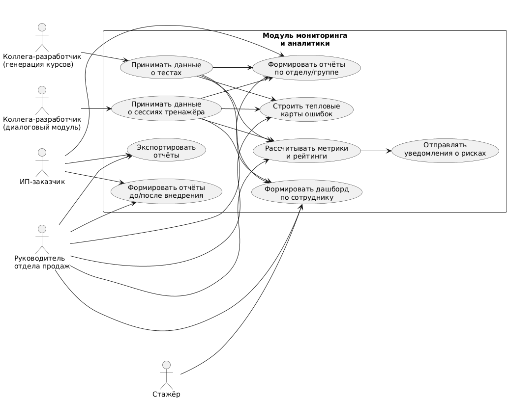

# Лабораторная работа №1  

## Тема
Формулирование требований к системе мониторинга и аналитики эффективности адаптации менеджеров по продажам в ИИ-платформе обучения персонала.

## Цель работы
Научиться анализировать потребности руководителей продаж в отчётности и сформулировать функциональные и нефункциональные требования к модулю аналитики и мониторинга, интегрированному с модулями генерации курсов/тестов и диалогового тренажёра.

---

## Перечень заинтересованных лиц (стейкхолдеров)

1. **ИП-заказчик проекта**  
   Ожидает подтверждения экономического эффекта от внедрения платформы: сокращение сроков адаптации, снижение затрат на обучение, рост ключевых бизнес-показателей.

2. **Руководитель отдела продаж**  
   Основной пользователь отчётов: контролирует прогресс стажёров, выявляет типовые ошибки по этапам воронки и продукту, принимает решения о дальнейшем обучении и допуске к работе.

3. **Стажёры (новые менеджеры по продажам)**  
   Косвенные стейкхолдеры: получают индивидуальные отчёты о собственном прогрессе, видят динамику и рекомендации по темам для повторения.

4. **Опытные менеджеры по продажам и наставники**  
   Могут использовать агрегированные отчёты для помощи стажёрам, ориентируясь на выявленные слабые места и ошибки.

5. **Коллега-разработчик — (генерация курсов и тестов)**  
   Предоставляет данные о попытках тестов и ожидает корректной аналитики по темам и курсам, чтобы на их основе улучшать содержание и параметры тестов.

6. **Коллега-разработчик — (диалоговый тренажёр и чат-бот)**  
   Передаёт логи диалогов и оценки, рассчитывает на агрегированные показатели (по сценариям, этапам воронки, типам возражений) для доработки сценариев и логики оценивания.

---

## Перечень функциональных требований

1. **Сбор данных о результатах тестов**  
   - Приём информации от модуля Студента 1: пользователь, курс, тема, дата и время, результат, количество ошибок, длительность прохождения.  
   - Сохранение этих данных в аналитической модели.

2. **Сбор данных о сессиях диалогового тренажёра**  
   - Приём данных от модуля Студента 2: сценарий, длительность, оценки по этапам, типовые ошибки, неотработанные возражения.  
   - Привязка данных к пользователю, сценарию и периоду.

3. **Единая модель данных для аналитики**  
   - Связь результатов тестов, диалогов, курсов, тем и сценариев с конкретными пользователями и периодами времени.  
   - Возможность строить аналитические запросы по различным измерениям (по сотруднику, по теме, по сценарию и т.п.).

4. **Дашборд прогресса по сотруднику**  
   - Карточка стажёра: статус прохождения курсов, динамика результатов тестов, количество сессий тренажёра и их эффективность.  
   - Выделение основных слабых мест (темы, этапы воронки, типы возражений).

5. **Групповые отчёты по отделу/группе**  
   - Распределение стажёров по уровням готовности.  
   - Проблемные темы и этапы воронки в разрезе группы.  
   - Показатели активности (количество тестов и сессий за период).

6. **Отчёты по этапам воронки и типам ошибок**  
   - Выявление этапов, на которых чаще всего происходят ошибки (приветствие, выявление потребностей, презентация, обработка возражений, закрытие).  
   - Анализ типичных причин отказов и недочётов в диалогах.

7. **«Тепловые карты» ошибок**  
   - Визуализация частоты ошибок в разрезе «тема × сотрудник» и «этап воронки × сотрудник/группа».  
   - Возможность быстро обнаруживать «красные зоны» в обучении.

8. **Фильтры и аналитические срезы**  
   - Фильтрация отчётов по периодам, курсам, сценариям, группам стажёров, наставникам.  
   - Возможность сохранять типовые наборы фильтров.

9. **Расчёт интегральных метрик и рейтингов**  
   - Индекс готовности стажёра на основе результатов тестов и диалогов.  
   - Рейтинг стажёров и групп.  
   - Среднее время достижения заданного порога готовности.

10. **Отчёты «до/после внедрения системы»**  
    - Ввод исходных показателей (например, средний срок адаптации до внедрения).  
    - Сравнение с текущими результатами, расчёт экономии времени и ресурсов.

11. **Экспорт отчётов**  
    - Экспорт дашбордов и отчётов в форматы PDF/Excel для предоставления ИП-заказчику и руководству, а также для дальнейшего анализа.

12. **Система уведомлений о рисках**  
    - Настройка пороговых значений показателей (например, стагнация прогресса, частые критические ошибки).  
    - Автоматическая отправка уведомлений руководителю и/или наставнику при превышении порогов.

---

## Диаграмма вариантов использования

## Перечень сделанных предположений

1. Модули Студента 1 и Студента 2 предоставляют данные в согласованном формате (через REST API или очередь сообщений); идентификаторы пользователей и курсов унифицированы.  
2. Модуль аналитики работает в основном с историческими данными и не требует строгого «онлайн-режима»; задержка несколько минут между событием и его появлением в отчётах считается приемлемой.  
3. В рамках лабораторной работы интеграция с реальными CRM-данными по продажам не выполняется; расчёты экономического эффекта являются модельными и основаны на заданных параметрах.  
4. Для аналитики используется отдельная схема БД или витрина данных, куда регулярно поступают агрегированные данные из операционных модулей.  
5. Ответственность за корректность исходных данных лежит на модулях-источниках; модуль аналитики обеспечивает проверку консистентности и агрегирование.

---

## Перечень нефункциональных требований

1. **Производительность аналитических запросов**  
   - Формирование типового дашборда по сотруднику или группе — не более 5 секунд при объёме данных до 100 пользователей и нескольких тысяч записей.  
   - Возможность дальнейшей оптимизации (индексы, материализованные представления, кэширование) при росте объёма данных.

2. **Надёжность и целостность данных**  
   - Встроенные проверки целостности при приёме данных (валидация идентификаторов пользователей, курсов, сценариев).  
   - Регулярное резервное копирование БД для предотвращения потери исторических данных.

3. **Удобство использования отчётов**  
   - Понятный интерфейс с графиками, диаграммами и тепловыми картами.  
   - Возможность сохранить и быстро применять часто используемые фильтры и срезы.

4. **Конфигурируемость и расширяемость**  
   - Возможность добавлять новые метрики и отчёты без кардинальной переработки архитектуры.  
   - Настройка пороговых значений для уведомлений и уровней «риска» через конфигурационные параметры.

5. **Безопасность и разграничение доступа**  
   - Доступ к персональным данным стажёров строго по ролям (руководитель — ко всем, стажёр — только к своим данным).  
   - Экспорт отчётов с персональными данными ограничен и логируется (кто, когда и какой отчёт выгрузил).
